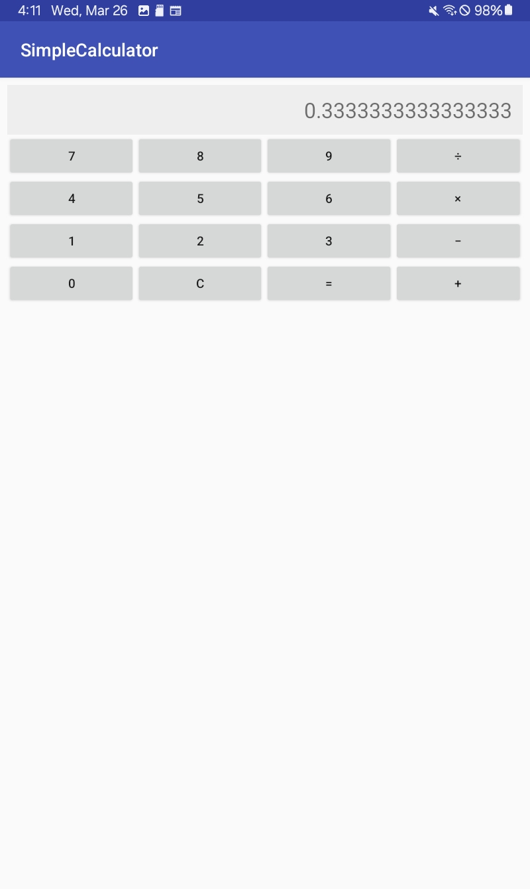
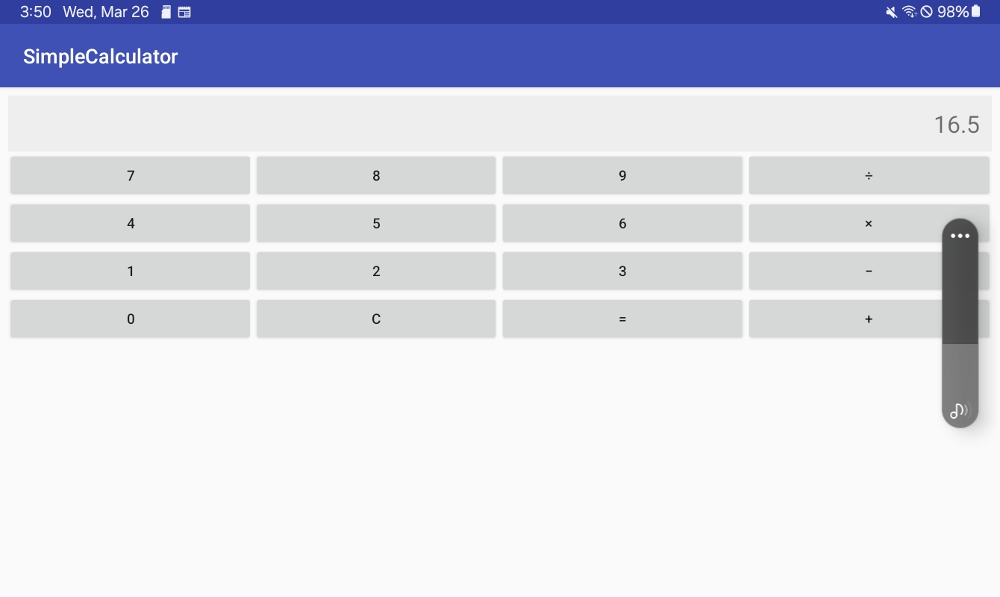

# LightweightCalculator

A **lightweight calculator application** that can replace the stock calculator on older devices.  
Compatible with **Android 2.3.3 (Gingerbread)** through **the most current** Android versions.

- **Min SDK:** 10 (Android 2.3.3)
- **Target SDK:** 26 (Android 8.0)
- Developed in **Android Studio 3.0.1** (Released November 20th, 2017).
- Basic arithmetic: `+`, `−`, `×`, `÷`, plus a clear button.

 

## Screenshots

| Vertical Orientation                                            | Horizontal Orientation                                               | HTC EVO 4G (Android 2.3.5)                                        |
|-----------------------------------------------------------------|---------------------------------------------------------------------|-------------------------------------------------------------------|
|              |              |            |

 

## Demo Video

*Click on the image to watch the video on YouTube.*

 

## Download & Install

### 1. Download the Latest APK

[**Download the Debug APK**](https://github.com/nathanavincent/LightweightCalculator/releases/download/v1.0.0/app-debug.apk)

### 2. Installation on Android

1. On devices **Android 9 (Pie)** and newer, you may see a security warning when installing this app (because it targets an older API level).
    - You can tap the dropdown under the warning, select **Install anyway**, and proceed.
2. On older devices (Android 2.3.3 ~ 8.x), just enable “Unknown sources” if prompted.

> **Note**: This warning appears because the app’s `targetSdkVersion` is 26 and **minSdkVersion** is 10 (Gingerbread). Modern Android devices see older-targeted apps as potential security risks. In this specific case, it’s safe to proceed.

 

## Why Use This App?

- **Runs on extremely old devices** (Android 2.3.3) that can’t install modern apps.
- **Lightweight alternative**: ideal for users who root older phones/tablets, remove the stock calculator, and want a simple replacement.
- Confirmed to **work fine** up to the latest Android versions; tested on modern devices, though a warning is shown prior to install.

 

## Building From Source

1. Clone or download the repository.
2. Open in **Android Studio 3.0.1** (or a comparable environment).
3. Make sure `minSdkVersion=10` in your `app/build.gradle`.
4. Build/Run on your device or emulator.

---

